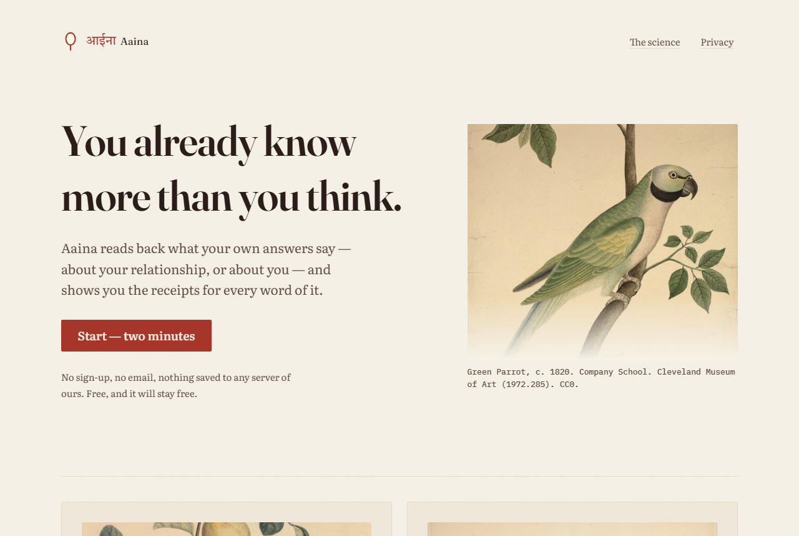
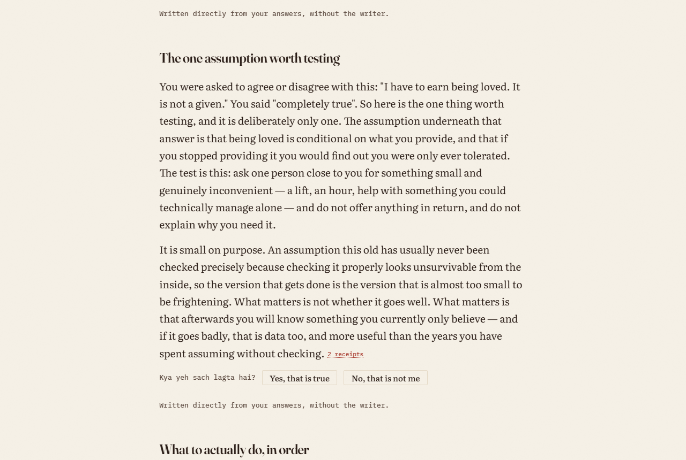
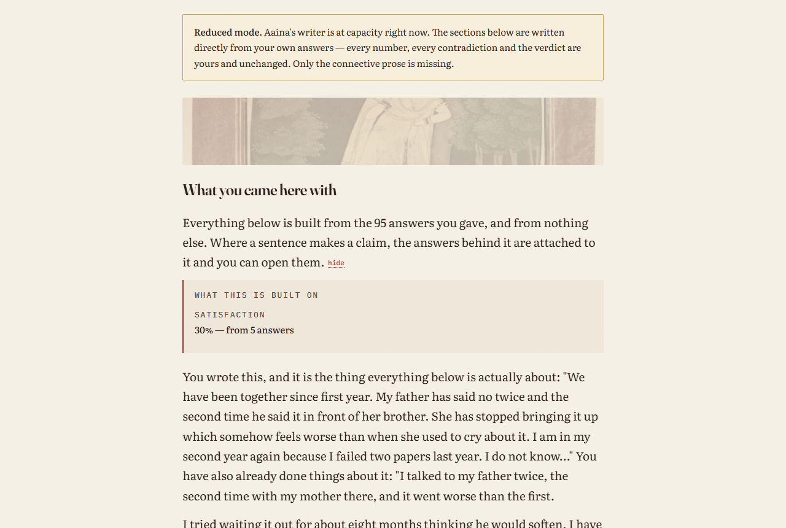
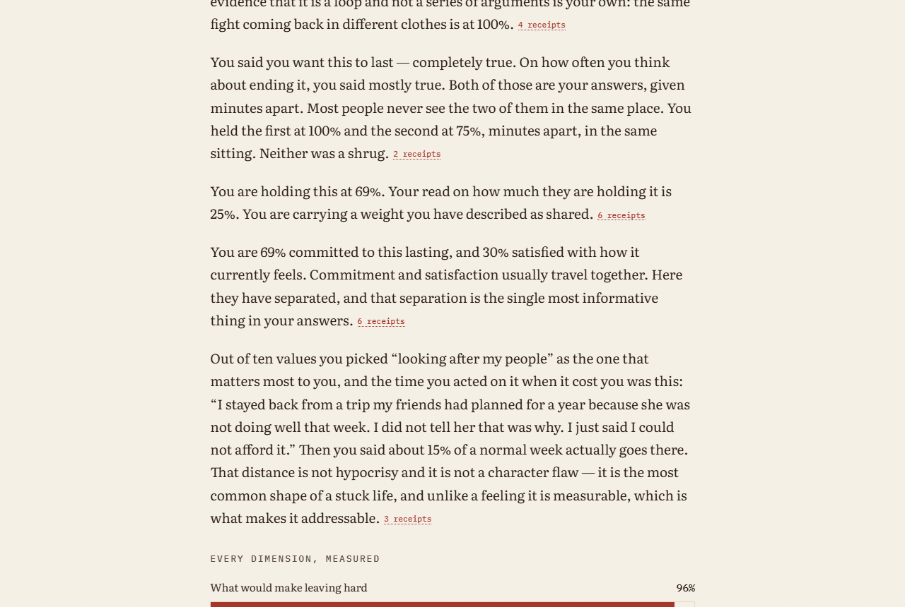
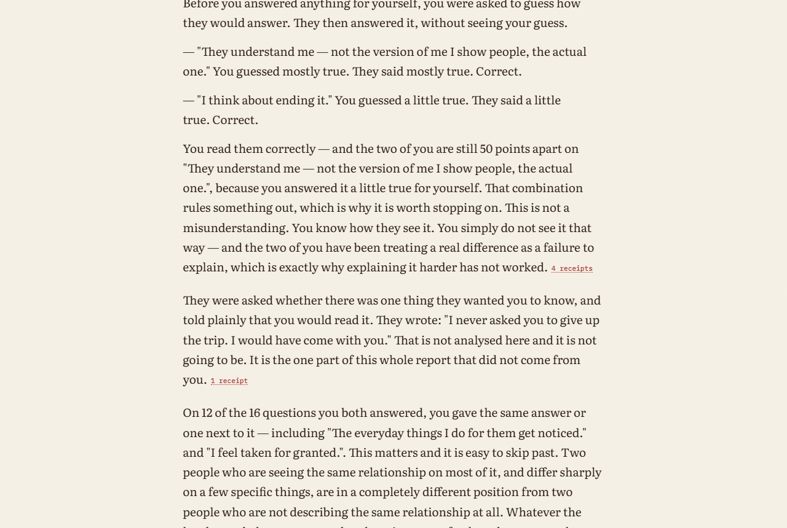
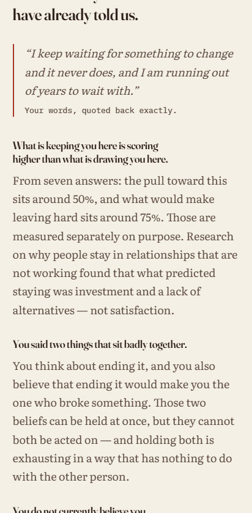
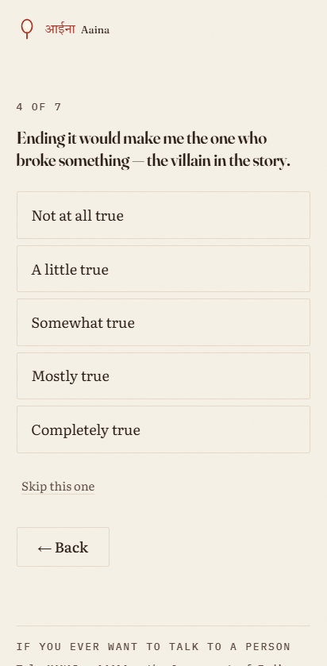
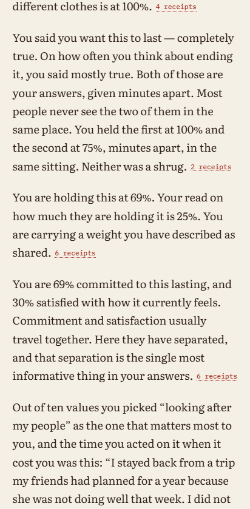

# Aaina · आईना

**A mirror, not a verdict.** Two halves: an honest reading of a relationship you are in, and an
honest reading of yourself. Both end with something to actually do.

Free. No account. Nothing you write is stored anywhere. Made in India, for India.

**Live:** https://aaina-two.vercel.app

<p align="center">
  
</p>

---

## What it is

Most relationship tools compute a compatibility percentage and stop. Aaina does something
different, and the difference is the whole product:

**It remembers every answer, and holds them against each other.**

A good facilitator creates insight by remembering what you said an hour ago and putting it next
to what you just said. That is the one thing software does better than a person — not
approximately, but perfectly, across 130 answers. Everything else here exists to serve it.

So instead of *"you scored 72% compatible"*, Aaina says things like:

> You said you are allowed to take up space — mostly true. You also said your needs come after
> everyone else's, and that that is just how it is — completely true. The first is the belief you
> hold. The second is the rule you run.

You can click that sentence and see the two questions and the two answers behind it.

### It is not a compatibility checker

Compatibility is one reason people see a therapist and nowhere near the main one. Aaina takes the
problem you actually walk in with — in your own words, with room to write it properly — and works
on that. In-laws who want you to move in. Money since the baby. A rishta you have three weeks to
answer. One-sided love. A rough patch. A marriage of fourteen years you have been deciding about
for four of them. Someone who left in April.

There is no menu of problems anywhere in the product, because any list would fail the first person
whose situation is not on it. What the engine triages is the **shape of help** you asked for —
understand, decide, repair, endure, recover — which is finite, and which is what therapists
actually triage on.

### The two doors

| | |
|---|---|
| **Where this actually stands** | The relationship, closely. Four separated axes, the contradictions between your own answers, and a verdict that can say *stay*, can say *this should end*, and is built so it can honestly say *neither*. |
| **Know thyself** | You, without a relationship in it. Your values, the pattern you run, the belief underneath it that the pattern is protecting, the place it did not hold, and the person you said you want to become. |

The Know Thyself half ends on one belief, made falsifiable, with the smallest experiment that
would actually test it — because an assumption that is merely named has been diagnosed, and the
difference between a reader who understood their report and one who did something because of it
is whether anything asked them to go and find out something nobody knows yet.

<p align="center">
  
</p>

---

## What makes it different

### Every claim is openable

<p align="center">
  
</p>

Nothing renders without its receipts. This exists because of a finding from 1972: people rate
identical, completely generic feedback as **more** accurate when it is merely labelled "written
specifically for you." The label is the trick. Openable evidence is the only defence against it,
so the renderer refuses any paragraph whose citations do not resolve.

### The percentages are real, and they are not comparisons

Every number is **POMP** — Percentage of Maximum Possible. "68% on trust" means you answered 68%
of the way up the trust scale. It is a restatement of what you did, not a ranking against
strangers. The overall figure weights dimensions by how strongly published research ties each one
to outcomes, and the bar chart **is** the composite — there are no hidden weights.

### Four axes, kept apart

Quality · Pull · Hold · Safety. **Pull** is what draws you toward someone. **Hold** is what would
make leaving hard regardless of how it feels. Measuring them apart is what lets the report reach
*"this is being kept in place by what leaving would cost"* — a conclusion no single satisfaction
score can produce, and the one Rusbult's investment-model work says is most often true.

Safety never moves quality. A safety disclosure may only ever **add** to what you are offered;
there is no path in the product where telling us more gets you less.

### It ends with things to do

<p align="center">
  
</p>

27 named interventions from published clinical work — softened start-up, cycle-naming,
decisional balance, WOOP, behavioural activation, a time-use count for invisible labour, Bowen
differentiation, grief structure. The engine chooses them; the writer only explains them. Each
comes with what to do the first time, what to do when it goes badly, and what would be observably
different in six weeks if it worked.

### Both of you, if they will

<p align="center">
  
</p>

Twenty questions for the other person, about six minutes, answered without seeing anything the
first person said. Both halves travel in a URL fragment — which is never sent to a server — through
whatever app the couple already use. Nothing reaches us in either direction, and the safety chapter
is barred from the link in code, with a test that pushes a disclosure at it and checks it comes out
the other side missing.

It does **not** make the reading more accurate; nothing can, from one more account. What it adds is
the one thing a single account cannot give: the distance between two versions of the same
relationship — and the mark on the guess, because the first person was asked to predict two of
their partner's answers before giving their own.

The sharpest thing it finds is when somebody guesses right and the two of them still disagree.
That rules out the explanation both of them have been using.

### It holds both ends of India

Most people here are living somewhere between a modern life and a traditional obligation, and that
distance is itself one of the largest sources of difficulty. Aaina measures it the way the research
does — ask what you hold, ask what you believe your family holds, take the distance — and never as
a modern-to-traditional score, because those are separable dimensions rather than two ends of one
line, and a single axis would quietly rank one end as more evolved.

It also measures the two halves of filial piety separately, because they are separate: wanting to
care for your parents runs with people doing better, and obedience that overrides your own
judgement runs with people doing worse. Keeping them apart is what allows the truest sentence
available to somebody caught in the middle — *the part of you that wants to look after them is not
the part that is hurting you.*

**No side is ever taken against anyone's family.** Not "set boundaries", not "it's your life, not
theirs", not "toxic". Those sentences are useless to someone who will be at the same dinner table
on Sunday, and twelve of them are in a banned-phrase list the writer is checked against.

---

## Privacy, stated in one sentence

**Nothing is stored by us; something is transmitted by us.**

Your answers live in your own browser and nowhere else — no account, no database, no analytics on
what you wrote. To write the prose, a derived summary (scores, computed findings, and short
verbatim quotes you wrote) is sent to Groq, whose terms bar training on it. That is the whole
trade, and it is stated inside the product too, not just here.

The safety chapter is stricter still: those answers are held in memory only, never written to
storage, and a test asserts it.

---

## The stack

Vite · React 19 · TypeScript · Tailwind (CSS-first `@theme`) · Zustand · wouter · Motion ·
Recharts · Vitest · Playwright. One serverless function. No database, no auth, no paid service.

```
src/engine/      derive(input) → EvidencePacket. The single state authority; nothing re-derives.
src/items/       167 items, each tracing to a named published construct.
src/report/      the client orchestrator, and the deterministic report used when the writer is down.
api/write.ts     the only holder of the API key. zod allowlist, throttled, never logs a body.
```

### Running it

```bash
npm install
npm run dev            # http://localhost:5173
npm run verify         # secret scan + build + tests + both gates. The definition of done.
npm run eval:generic   # the anti-generic gate, deterministic
npm run eval:live      # the same gate against the real writer
npm run audit          # the five failure tests, measured on the finished text
npx playwright test    # 42 journeys, desktop and mobile
```

It runs with **no API key at all**. Every number, every contradiction, every practice and the
verdict itself are computed in TypeScript; the writer's job is only to make them read like a person
wrote them. When it is unavailable the report says so on screen, in those words, and still
delivers the analysis — a silent fallback is banned.

---

## How it is checked

- **211 unit tests** and **52 browser journeys**, desktop and mobile.
- **The anti-generic gate** measures two different things: how often two people's reports reuse a
  frame, and how many claims lack anything specific to that person. The second currently sits at
  **0%**.
- Every psychological claim traces to one of **71 sources**; a test fails on any citation that
  does not resolve, and on any source in the registry that nothing cites.
- Two of the test personas are deliberately *similar*, because the transplant problem has to be
  solved for the hard case rather than the obvious one.
- **`npm run audit`** measures the five ways this is allowed to fail, on the finished text:
  whether it lands as insight rather than description, whether any claim could have been written
  for somebody else, whether it hands over exercises rather than advice, whether it converges, and
  whether anything in it reads as generated. It prints the offending sentences when it finds any,
  and it runs as part of `npm run verify`.

<p align="center">
  
  
  
</p>

---

## Credit where it is taken from

The mechanism is borrowed, deliberately, and named rather than hidden:

- **Therapeutic Assessment** (Finn) — feedback is delivered in ascending order of how discrepant it
  is with what you already believe, and Level-1 material is capped at 30% of the word count.
- **SPIKES** (Baile) — the warning shot before the hard section.
- **Discernment counselling** (Doherty) — help for deciding and help for repairing are different
  work, and giving somebody the wrong one fails.
- **Immunity to Change** (Kegan & Lahey) — one Big Assumption, made falsifiable, with the smallest
  experiment that would actually test it.
- **Narrative therapy** (White & Epston) — no pattern is ever stated without finding, in the
  person's own answers, a place where it did not hold.
- **Motivational interviewing** (Miller & Rollnick) — juxtapose, do not resolve. The decision is
  returned to the reader explicitly.

---

## What it will not do

It does not predict. There are no probabilities and no forecasts anywhere in it — equations that
claimed to predict whether relationships end lost roughly half their accuracy the moment they were
tested on people they had not been built from. Everything is present tense on purpose.

It does not diagnose, and it is not therapy. It is one honest reading, built only from what you
told it, that says so about its own limits in the product rather than in a footnote.

---

MIT. Built by [Shaurya Verma](https://github.com/SHV27).
